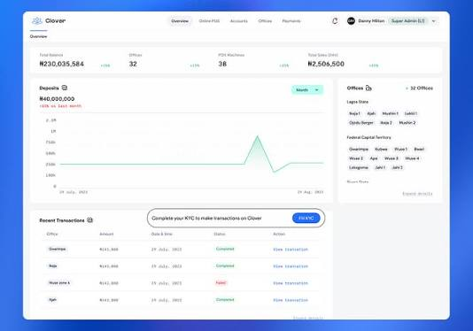
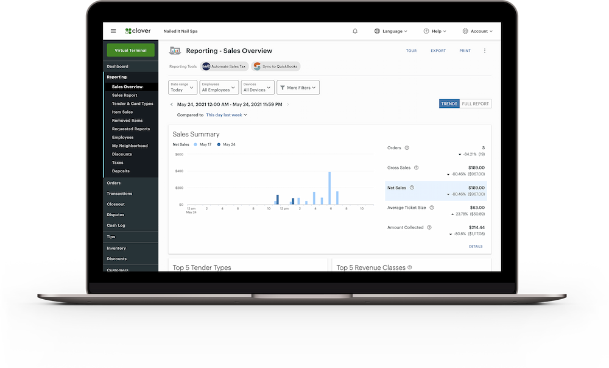
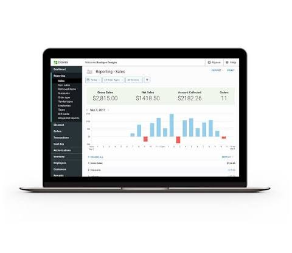

# clover dashboard

clover dashboard is the web desk for a clover merchant: sales, inventory, staff, and customers in one sign-in. clover com dashboard and clover web dashboard are the same desk in the browser. clover pos dashboard is that desk next to the register.

You sign in, open Home for the day, then jump to Sales Activity, Reports, Items, Employees, or Customers. clover dashboard reporting and clover dashboard inventory live on those tabs. clover dashboard sales is the order and payment trail.

## Introduction

clover dashboard is a browser console. A clover merchant uses it to watch daily take, edit items, set roles, and read customer history. It does not replace the physical register. It is the office view of the same store.

Home shows a snapshot: sales, cash, and a short performance strip. Sales Activity lists orders, payments, cash logs, invoices, and recurring charges. Reports cut those numbers by day, item, or staff. Items hold price, stock, and category. Employees hold logins and permissions. Customers hold profiles, tickets, and loyalty.

The home controller in this pack is [Home.php](Home.php). Sign-in is [Login.php](Login.php). Register UI is [register.php](sales/register.php). Sales actions are [Sales.php](sales/Sales.php).

| Tab | What a clover merchant does |
| --- | --- |
| Home | Daily sales and cash snapshot |
| Sales Activity | Orders, invoices, recurring pay |
| Reports | Trends and clover dashboard reporting |
| Items | Price, stock, categories |
| Employees | Roles and logins |
| Customers | History and loyalty |

clover pos dashboard and clover web dashboard share this map. clover dashboard eu and other regions use the same tabs with a regional host.

A single location sees one Home strip. A clover merchant with several stores uses clover multi location dashboard: pick a store, then the tabs filter to that store. Do not export a US report while the picker still sits on an EU shop.

Cash logs belong to the day you close, not to the browser clock if the device timezone differs. Set timezone on the device and in the desk once.

Invoices and recurring payments stay under Sales Activity. They are not a second product. A failed recurring row still shows on that list with a status.

Employees who only run the register may never open clover web dashboard. That is a role choice, not a missing license.

Home.php is a snapshot, not a warehouse. Stock edits go to Items. Do not fix a stock miss by editing a closed sale unless the vendor flow allows a void.

## About

clover dashboard is the merchant layer: not a theme pack, not a device ROM. clover merchant accounts open it after clover dashboard sign in. Multi-location stores switch a location picker, then the same tabs.

Virtual terminal sits under Sales Activity when the merchant is allowed to key a card. Inventory edits sit under Items. Support and setup pages on the vendor site are help, not a second desk.

clover dashboard features the vendor lists match this pack: Home, Sales Activity, Reports, Items, Employees, Customers. Extra App Market tiles can appear. They do not rename those six.

clover dashboard sales is the same Sales Activity list plus Reports. If a number on Home does not match Reports, wait for the day to close or filter both to the same location and tender.

Customer loyalty is a profile field, not a separate login. Edit it on Customers. Refunds stay on the original ticket in Sales Activity.

Item categories keep the register grid short. A category with no items still shows in Items until you delete it. Price changes push to the device after a short sync. If the register shows the old price, force a refresh on the device, not a second edit on the desk.

Staff credentials are per person. Shared PINs break clover dashboard reporting by employee. Create one row per hire in Employees.

Item catalog code is [Items.php](items/Items.php). Staff forms are [Employees.php](employees/Employees.php) and [form.php](employees/form.php). Reports entry is [Reports.php](reports/Reports.php). Customer forms are [Customers.php](customers/Customers.php) and the customer form.php in customers/.

Config for the web host is [Config.php](Config.php). App constants are App.php. Front controller is index.php.

Connection helpers for a device next to clover pos dashboard live in [CloverConnection.js](pay/CloverConnection.js) and ConnectionHelper.js under pay/. Title chrome is [TitleBar.js](pay/TitleBar.js).

## FAQ

**clover dashboard sign in fails.** Use the official clover com dashboard login. Check region (US vs clover dashboard eu). A wrong region looks like a bad password. Reset from the vendor page, not from a random mirror.

**clover dashboard not loading.** Clear the browser cache, try another browser, then check the vendor status note. clover dashboard down is rare; a local ad blocker on clover.com is more common.

**clover dashboard setup after a new device.** Pair the device from Device settings, then open clover web dashboard and confirm the location. Items sync from the desk to the register.

**Why can I not see a tab?** Employee roles hide tabs. An owner sees Reports. A cashier may only see register-side tools. Change roles under Employees.

**Virtual terminal missing.** The merchant plan may not include it. Confirm on clover dashboard features / billing, then retry Sales Activity.

**Inventory count wrong.** Edit stock on Items, then refresh the register. Kits use Item_kits.php in items/. A single SKU is Items.php.

Do not paste a machine-local loop address into a bookmark. Use the regional clover com dashboard host.

PHP 8+ pack samples expect a current runtime if you read the PHP files in this tree. The live clover dashboard is the vendor SaaS, not those samples.

**clover dashboard down for everyone?** Check the vendor status page and your ISP. If only one location fails, it is that store's network or a role lock, not a global outage.

**CSV export empty.** Pick a date range that has sales. A future date returns an empty clover dashboard reporting file. That is not a bug.

**EU login loop.** Bookmarks to the US host bounce. Save the EU URL after a good clover dashboard sign in.

**App Market app missing on the desk.** Install it for that merchant, then reload clover web dashboard. Device-only apps will not grow a new Home tile.

**Printer jobs from the desk.** Receipt reprint is on the ticket in Sales Activity. The desk does not own the kitchen printer. Test print from the device.

Avatar or item image not showing in a pack sample means a writable folder on that sample host. On the live clover dashboard, images are on the vendor CDN. Re-upload the photo on Items if a device still shows a placeholder.

Session drops behind a shop proxy are a firewall issue. Whitelist the clover.com hosts. Do not turn off HTTPS.

## Contributing

Vendor clover dashboard is closed. This pack is a handbook plus sample files. File a merchant ticket with location id, staff role, and the tab that failed (Home, Sales, Reports, Items).

Pull requests on this pack: one tab per change. Screenshots of clover web dashboard help more than a password. Never commit a live merchant token.

Routes for the sample pay UI are [routes.js](pay/routes.js). Order list helper is orders.js under pay/. Transaction rows are [Transactions.js](pay/Transactions.js).

Translations for a clover merchant stay on the vendor locale (en-US, EU languages). Do not invent locale files here.

## Reporting Bugs

Before you open a ticket, copy merchant id, device model, browser, and the exact tab. clover dashboard customer service and clover dashboard support use that set.

Security issues (a staff login that sees another store) go to vendor security, not a public thread.

If clover dashboard not loading only on one PC, capture the network tab host name. A hard redirect on login should stay on clover.com.

A ticket without merchant id gets bounced. Add the last four of the device serial if the issue is register sync.

Do not attach a full customer dump to a public post. Redact PAN and email. clover dashboard customer service can pull the ticket if you give the order id.

Config.php in this pack is a sample host config. It is not your live merchant config. Never put a production secret in App.php in a shared tree.

index.php is the sample front door. The live desk is the vendor login, not that file.

Cash-up samples are Cashups.php under sales/. Store model sample is Store.js under orders/.

## Keep the Machine Running

clover dashboard is a hosted desk. Keep the browser current. Do not run two owners in one profile. A second location is a location switch, not a second password in the same tab.

FUNDING.yml in this pack is metadata. Paying a pack tip does not fund Clover. clover merchant billing is on the vendor invoice.

Star this pack if the handbook helped. It does not change clover pos dashboard quotas.

Keep one owner as billing contact. A fired manager who still has clover dashboard sign in is a risk. Disable the Employees row the same day.

Cloud folder bookmarks in a password manager should store the regional host, not a redirect chain.

A franchise HQ can open clover multi location dashboard and roll Reports by store. A single-store clover merchant can ignore that picker.

If Home widgets fail to draw, disable a browser extension, then retry. Dark-mode extensions sometimes blank a chart. That is not clover dashboard down.

Print a close-of-day from Reports before you count the drawer. If cash in the drawer and cash on the report differ, check voids and no-sale opens on Sales Activity.

A seasonal item can be hidden on Items without a delete. Hidden items drop off the register grid and stay in clover dashboard inventory history.

Do not run clover dashboard setup twice for the same device. Pair once. A second pair fight is a common "not loading" on the device, not on the desk.

When you leave a shop PC, sign out. A stay-logged-in checkbox on a counter iPad is how a temp cashier opens Employees.

One desk, one merchant session. That is enough.

## Upgrades & Integrations

Vendor release notes land on clover.com. After an upgrade, sign in once on clover web dashboard and open Reports. clover dashboard reporting columns can shift; export again if a CSV header changed.

App Market apps attach to the same clover merchant. They do not replace Home. Device apps still report into Sales Activity.

Order transform samples are [transform-order.ts](orders/transform-order.ts). Order service is [order-service.ts](orders/order-service.ts). Order model files are order.ts and Order.js under orders/.

Item model sample is Item.js under items/. Product module sample is [product-module-service.ts](items/product-module-service.ts).

Analytics index is analytics-index.ts under reports/. Customer index is customer-index.ts under customers/.

Integrations (loyalty, invoices, capital) stay behind the same clover dashboard sign in. A third-party token still needs the merchant to be logged in.

## Community & Contributions

Vendor help, phone, and chat are clover dashboard support. This pack is not that queue.

If you add a sample file, keep it under sales/, items/, employees/, reports/, customers/, pay/, or orders/. Depth stays short.

index.ts at FILES root is a pack barrel, not a second desk.

product-index.ts and models-index.ts under items/ and customers/ are pack barrels too. Read them if you trace a sample, not as a live API.

Other channels on social sites are marketing. Billing changes still happen on clover com dashboard.

## Other channels

Vendor: clover.com dashboard login, help, app market, status. YouTube walkthroughs in the brief are demos. Envato "clover dashboard" templates are unrelated skins. Do not install those as the merchant desk.

EU merchants use the EU host. UK, Canada, Australia follow the regional login, not a US bookmark.

## Credits

Clover Network runs clover dashboard. This pack thanks the sample trees used for FILES only. Credits tables in those trees are not a second product name in this page.

| Channel | Use |
| --- | --- |
| clover com dashboard | Sign in |
| clover web dashboard | Browser desk |
| clover pos dashboard | Desk plus register |
| clover dashboard eu | Regional host |

## License

The live clover dashboard is a vendor service. This pack keeps one LICENSE at FILES root for bundled samples. Do not add a second LICENSE next to README.

Do not claim the clover merchant trademark. Do not strip license files from FILES.

Footer or about text on the live desk is vendor property. Do not replace it in a screenshot you publish as your own SaaS.

Pack samples under FILES may carry their own notices. Leave them. One LICENSE at the FILES root is the pack license file.

composer.json and package.json in FILES are pack manifests. pos-package.json and starter-package.json are extra manifests. webpack.config.js and server.js are pack build helpers. docker-compose.yml is a pack compose file.

## Download

Use the GET badge for this pack. Daily clover dashboard sign in is the official clover com dashboard login. There is no separate installer for the web desk. A clover merchant already has the account.

Pick the regional host (US, clover dashboard eu, UK, Canada, Australia). Then open Home, confirm sales, and open Items once.

### Running

After sign-in you land on Home. If the page is empty, the location has no sales yet or the role hides numbers. Open Employees and check the role.

clover dashboard setup for a new hire: create the staff row, pick a role, let them sign in on clover web dashboard. They should not share the owner password.

If clover dashboard not loading after a password change, wait a minute and retry. Two tabs with two merchants in one browser profile will fight cookies. Use a separate profile per clover merchant.

Keep bookmarks on HTTPS vendor hosts. Do not save a device IP as the desk.

First week on clover pos dashboard: add items, add two staff rows, run one cash sale on the device, then confirm it on Home and in Reports. If Home is empty after a sale, wait a minute and refresh. A still-empty Home with a receipt in hand is a location mismatch.

Nightly batch reports can lag. Do not close the books twice because the first CSV looked short. Filter by tender and void.

If you use clover dashboard virtual terminal, treat it like a card-present risk: do not email full card numbers. Key the payment on the official page only.

Owners who travel should use a password manager and a second factor if the vendor offers it. A cafe shared PC is a bad clover dashboard sign in host.

Uninstall is not a thing for the web desk. You stop using it by closing the tab and, if you leave the company, asking the owner to disable your Employees row.

docker-compose.yml, server.js, and webpack.config.js are pack helpers. They do not install clover dashboard on a laptop as a private clone of the SaaS.

A tablet browser works for Home and Reports. Heavy item imports are easier on a desktop. clover web dashboard is the same account on both.

If two owners edit the same SKU, the last save wins. Talk before a price change at open.

Gift cards and rewards, when the plan includes them, show under Customers or a dedicated tile. They still post into Sales Activity.

Receivings and suppliers, if you use pack samples, sit next to Items. On the live desk, purchase flow follows the vendor inventory screens.

Taxes are a location setting. A new clover dashboard eu location starts with that region's defaults. Do not copy a US tax row onto an EU store.

Messaging and email receipts are device and desk options. Test one ticket before a rush.

GDPR requests (export or delete a customer) go through vendor process. The Customers tab is the starting list, not a legal export by itself.

## Related Search Terms

clover dashboard, clover merchant, clover web dashboard, clover pos dashboard, clover com dashboard, pos, payments, inventory, dashboard, merchant, reporting, commerce, typescript, inventory-management
